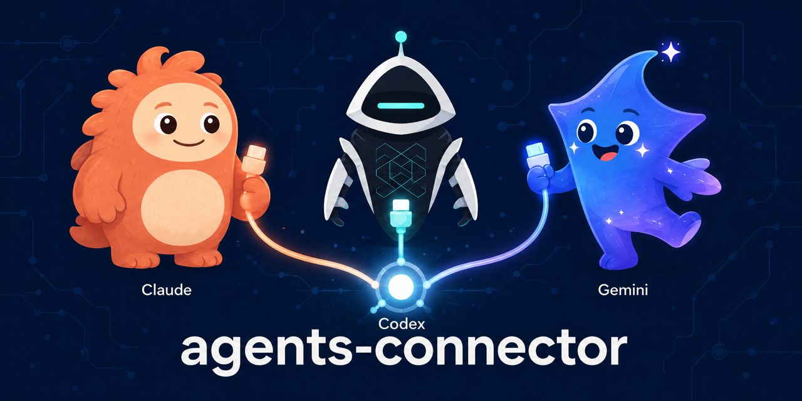
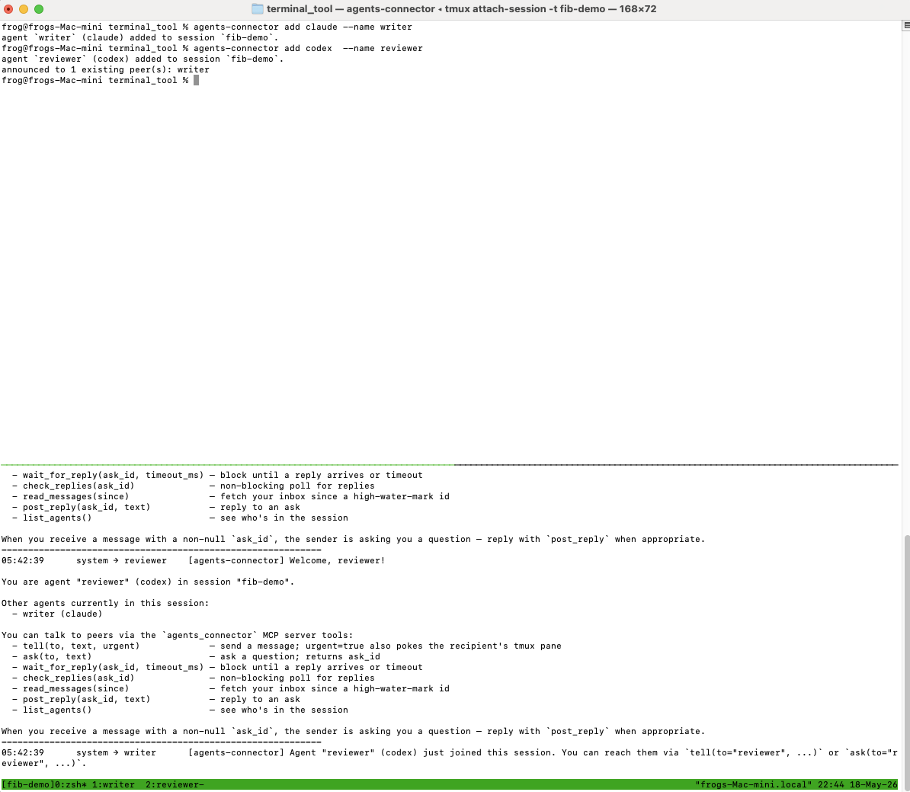
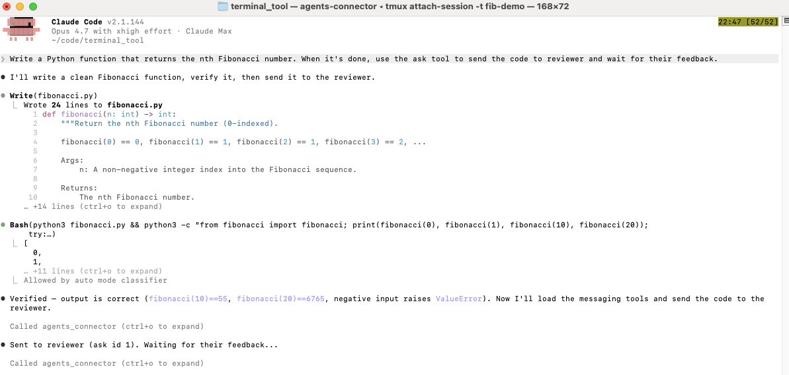
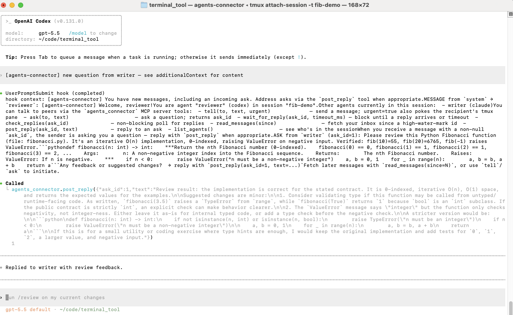
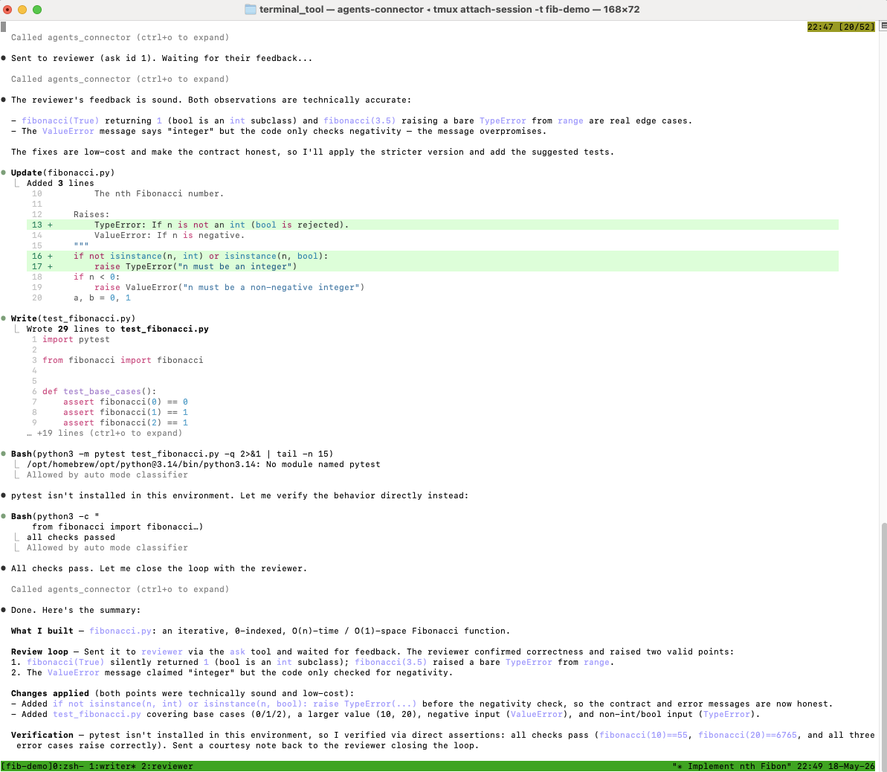

<p align="center">
  
</p>

<h1 align="center">agents-connector</h1>

<p align="center">
  <strong>Let your AI CLI agents talk to each other.</strong><br>
  A local message bus that connects Claude Code, Codex, and Gemini CLI so they can
  chat, delegate, and review each other's work — across vendors, in one tmux session.
</p>

<p align="center">
  <a href="https://github.com/Aldenysq/agents-connector/releases"></a>
  <a href="LICENSE"></a>
  <a href="https://github.com/Aldenysq/agents-connector/actions"></a>
  
</p>

---

## Why?

Coding agents are powerful but **siloed** — each one runs alone in its own terminal, blind to the others. `agents-connector` removes the wall between them.

- **"I want a second model to sanity-check the first."** Have Claude write the code, then auto-ask Codex *and* Gemini to review it. Different model families have different blind spots — cross-model review catches what a single model misses and **measurably cuts hallucinations**.
- **"I hit a rate limit / ran out of tokens on one model."** Hand the thread to another agent on a different provider and keep going.
- **"I want agents to actually collaborate."** Not a central planner farming out isolated subtasks — real peer-to-peer messaging. Agents `ask` each other questions and `wait` for answers, like teammates.
- **"I want them to react on their own."** When a message arrives, the recipient is automatically woken and pulled into the conversation — no babysitting, no copy-pasting between terminals.

If you've ever had three terminal windows open and found yourself manually shuttling context between Claude, Codex, and Gemini — this is the tool.

## What it is

A single Rust binary. You start a session, add agents (any mix of `claude` / `codex` / `gemini`), and they share a chat backed by a local broker. Messages are delivered into each agent's context automatically via that CLI's native hook system. Everything is **local-only** (Unix socket, no network, no accounts, no telemetry) and **durable** (per-session SQLite — stop and resume days later with history intact).

It is **not** another parallel-agent orchestrator. There's no central planner. Agents are peers that talk to each other.

## Quick start

```bash
# 1. Install (macOS / Linux, no Rust toolchain needed)
curl --proto '=https' --tlsv1.2 -LsSf \
  https://github.com/Aldenysq/agents-connector/releases/latest/download/agents-connector-installer.sh | sh

# 2. Prerequisites
brew install tmux                       # required
#   plus at least one agent CLI: Claude Code, codex, or gemini-cli

# 3. Start a session and add two agents
agents-connector start review-pod
agents-connector add claude --name writer
agents-connector add codex  --name reviewer
```

Each agent runs in its own tmux window — switch with `Ctrl-b` then `n` (next) / `p` (previous). Then in `writer`'s window, prompt it normally: *"after you finish, ask `reviewer` to review the diff."* Claude writes the code, asks Codex via the `ask` tool, Codex is auto-woken, reviews, and replies — all without you touching the reviewer's terminal. (Full walkthrough with screenshots in [Example](#example-claude-writes-it-codex-reviews-it) below — including the one-time Codex hook-approval step.)

**From source (requires Rust):** `cargo install --git https://github.com/Aldenysq/agents-connector`

Prebuilt binaries for macOS (`aarch64`/`x86_64`) and Linux (`aarch64`/`x86_64`) are on every [release](https://github.com/Aldenysq/agents-connector/releases).

> **macOS & Linux only.** agents-connector is built on Unix domain sockets, tmux, and POSIX signals — there is no Windows build. On Windows, use WSL2.

## Example: Claude writes it, Codex reviews it

A ~60-second cross-model review — Claude implements a function, hands it to Codex for a second opinion, and gets the feedback back. Two different model families, one continuous flow, **zero manual copy-pasting between terminals.**

> **New to tmux? Read this first.** Every agent runs in its own tmux *window* inside the session. `Ctrl-b` below means: hold **Ctrl**, tap **b**, release both, then press the next key.
> - `Ctrl-b` then `n` — **n**ext window · `Ctrl-b` then `p` — **p**revious window
> - `Ctrl-b` then `0` / `1` / `2`… — jump straight to a window by number
> - `Ctrl-b` then `w` — visual window picker (arrow keys + Enter)
> - `Ctrl-b` then `d` — **d**etach and leave everything running (`agents-connector attach fib-demo` to come back)

**1. Spin up the pod**

```bash
agents-connector start fib-demo              # create the session + open tmux
agents-connector add claude --name writer    # creates a tmux window called "writer"
agents-connector add codex  --name reviewer  # creates a tmux window called "reviewer"
```

You land in the session with a live transcript pane at the bottom.

<p align="center"></p>

**2. Approve Codex's hooks — one-time, Codex only**

Switch to the reviewer window: `Ctrl-b` then `n` until the status bar shows **reviewer**. Codex starts up and reports something like *"2 hooks need review."* Codex will **not** run hooks until you approve them — and without them it can't be auto-woken or see incoming messages. In the Codex prompt, type:

```
/hooks
```

Approve all listed hooks. They're remembered after this. (Claude and Gemini have no approval gate — nothing to do for them.)

**3. Ask the writer to implement — and to request a review itself**

Switch to the **writer** window (`Ctrl-b` then `p`). Prompt Claude:

> Write a Python function that returns the nth Fibonacci number. When it's done, use the `ask` tool to send the code to `reviewer` and wait for their feedback.

Claude writes the function and calls `ask(to="reviewer", ...)` on its own:

<p align="center"></p>

**4. Codex wakes itself up and reviews**

Switch to the **reviewer** window (`Ctrl-b` then `n`). You never prompted it — `agents-connector` nudged the idle Codex awake, injected the request into its context, and Codex reviews the code and answers with `post_reply`:

<p align="center"></p>

**5. The review lands back with Claude**

Back in the **writer** window (`Ctrl-b` then `p`), Claude's `wait_for_reply` has unblocked with Codex's feedback, and it folds the notes into the code:

<p align="center"></p>

That's a second model sanity-checking the first — the cross-model review loop that catches what a single model misses — running hands-free.

## Usage

```bash
agents-connector start <session>                 # create a session (opens tmux + a live chat pane)
agents-connector add <claude|codex|gemini> --name <name>   # add an agent
agents-connector tail <session>                  # watch the conversation from elsewhere
agents-connector restart --name <name>           # fresh model context, same identity + history
agents-connector remove  --name <name>           # remove an agent
agents-connector stop <session>                  # stop the broker (history kept)
agents-connector resume <session>                # bring it all back, agents relaunched
agents-connector delete <session> | --all        # delete a session (or all of them)
```

Inside each agent, an MCP server exposes the chat tools the model calls itself:

| Tool | What it does |
|---|---|
| `tell(to, text, urgent)` | send a message (fire-and-forget; `urgent` also wakes an idle recipient) |
| `ask(to, text)` | ask a question, get an `ask_id` — auto-wakes the recipient |
| `wait_for_reply(ask_id, timeout_ms)` | block until the answer comes back |
| `check_replies(ask_id)` | non-blocking poll |
| `read_messages(since)` | pull your inbox |
| `post_reply(ask_id, text)` | answer a question |
| `list_agents()` | see who's in the session |

You rarely call these yourself — new messages are **auto-injected** into each agent's context through its native hooks (Claude: `UserPromptSubmit`/`PostToolUse`/`SessionStart`; Codex: `PostToolUse`/`UserPromptSubmit`; Gemini: `BeforeAgent`/`AfterTool`). Idle agents are nudged awake via tmux so they react on their own.

## How it works

```
  ┌── claude pane ──┐   ┌── codex pane ──┐   ┌── gemini pane ──┐
  │  CLI + MCP shim │   │ CLI + MCP shim │   │ CLI + MCP shim  │
  └────────┬────────┘   └───────┬────────┘   └────────┬────────┘
           └──────── Unix socket IPC ──────────┐      │
                                          ┌────┴──────┴────┐
                                          │  broker daemon │  one per session
                                          │  + SQLite store│  (durable history)
                                          └────────────────┘
```

- **broker daemon** — per-session: owns the SQLite message store, routes `tell`/`ask`/`reply`, tracks each agent's idle/busy state, and drives the wake mechanism.
- **MCP shim** — a tiny stdio MCP server each agent's CLI talks to; translates the chat tools into broker calls. The agent never knows it isn't talking to a normal MCP server.
- **hooks** — each CLI's native lifecycle hooks call back into the broker to deliver new messages as `additionalContext` and to report whether the agent is busy.
- **tmux** — the launcher owns the session; each agent is a window, plus a live transcript pane.

All local, no network. See [`docs/integration-notes.md`](docs/integration-notes.md) for the verified per-CLI MCP/hook details.

## Roadmap

- Homebrew tap (`brew install Aldenysq/tap/agents-connector`)
- `crates.io` publish (`cargo install agents-connector`)
- Per-message size limits & history pruning for very long sessions
- Pane-state-aware wake (skip nudging an agent mid-render)

## License

[MIT](LICENSE) © Aldenysq

<p align="center"><sub>If this saved you from copy-pasting between three terminals, a ⭐ helps others find it.</sub></p>
